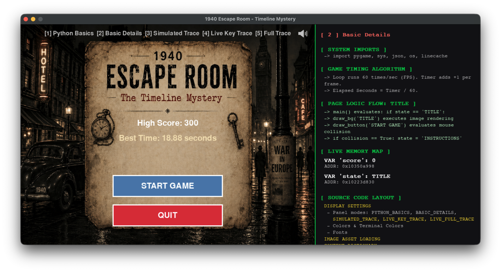
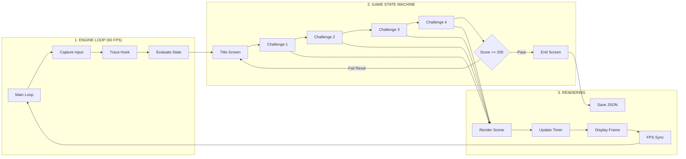

# 🕰️ Exploring Coding and Programming: Timeline Mystery

**An interactive 1940s Noir Escape Room built to teach Python fundamentals in real-time.**

Welcome to our FBLA Educational coding project! This application bridges the gap between playing a game and understanding the software architecture underneath it. Solve puzzles to escape the 1940s, while using in-game "Tech Panels" to watch the Python interpreter execute your logic line-by-line.

- **No prior coding skills needed** — learn by interacting with the environment.
- **Watch the computer think** — live-trace the Python engine as you click buttons.
- **Built on industry standards** — utilizes Python, Pygame, Finite State Machines, and JSON Data persistence.


---

## 📸 Visual Preview


> *The game interface featuring the Title Screen and the interactive "Basic Details" Tech Panel.*

---

## 💡 A Note for Beginners

If you are looking at the source code for this game and feeling overwhelmed by the wall of text—**don't panic!** Software engineering is not magic; it is just a series of logical instructions, exactly like a cooking recipe. Every massive application in the world is built on the same foundational blocks: variables, loops, and conditional statements (`if` this, `then` that). 

We designed this game with interactive "Tech Panels" that you can open while playing. These panels will trace the code in real-time, showing you exactly how the computer thinks as you click buttons and solve puzzles. Dive in, break the code, change the colors, and see what happens. Making mistakes is the fastest way to learn!

---

## 🚀 Quick Start (3 Steps)

### Step 1: Install Python
Ensure you have Python 3.x installed on your machine. You can download it from [python.org](https://www.python.org/downloads/).

### Step 2: Install Pygame
Open your computer's terminal or command prompt and install the Pygame multimedia library:
```bash
pip install pygame
```

### Step 3: Run the Game
Download this repository, navigate to the folder containing the downloaded files (ensure images and audio stay in the same folder as the script), and run the main game:
```bash
python actual_game.py
```

---

## 💻 The Tech Panels (Educational Modes)

While playing the game, press keys `1` through `5` on your keyboard to open the educational diagnostic panels. These panels explain the code running the exact screen you are currently viewing.

| Hotkey | Mode Name | Description |
| :--- | :--- | :--- |
| `[ 1 ]` | **Python Basics** | A quick-reference glossary of Python advantages, module definitions, and links to official documentation. |
| `[ 2 ]` | **Basic Details** | Shows the live Memory Map (tracking variable addresses in RAM), the 60 FPS timing algorithm, and the hardcoded logical flow of the current scene. |
| `[ 3 ]` | **Simulated Trace** | Displays a simulated `pdb` (Python Debugger) terminal output. True `pdb` halts the engine and crashes Pygame, so this mode safely *simulates* the step-by-step logic path the computer takes to draw the current room. |
| `[ 4 ]` | **Live Key Trace** | Uses `sys.settrace` to hook into the Python interpreter. It filters out UI drawing noise to show you only the core logic (like Score evaluations and State changes) in real-time. |
| `[ 5 ]` | **Live Full Trace** | The raw firehose. Shows every single line of Python code executing in the background, updating dynamically as you interact with the game. |

---

## 🏗️ System Architecture & Game Flow

The game runs on a continuous **60 FPS loop**, structured into three core layers:

1. **Input & Engine Control**
2. **Game State Machine (Logic Layer)**
3. **Rendering & Persistence (Output Layer)**



---

## 🗄️ Under the Hood: Data Dictionaries

Instead of writing hundreds of repetitive `if/else` statements, this application uses **Python Dictionaries** to store data logically and cleanly.

### `BG_FILES` (Asset Mapping)
Maps the exact `state` string to the physical `.png` file on the hard drive. 
```python
BG_FILES = {
    "STRANGE_ROOM": "bg_strange_room.png",
    "FDR_BROADCAST": "bg_fdr_broadcast.png"
}
```
*How it's used:* The `draw_bg()` helper function looks up the current state in this dictionary and renders the correct image to the screen.

### `CONTENT` (Puzzle Logic)
Stores all challenge data, multiple-choice options, and the integer index of the correct answer.
```python
CONTENT = {
    "challenge1_options": ["Lend-lease act", "Freedom of Speech act", "Space Act", "Digital Act"],
    "challenge1_correct": 0, # Index 0 is "Lend-lease act"
}
```
*How it's used:* A `for` loop dynamically reads this array to draw the four buttons on the screen. If the button clicked matches the `challenge1_correct` index, the game awards 75 points.

### `LOGIC_PATH_TRACE` (Hardcoded Tech Panel Data)
Because running a true terminal debugger would crash the graphical window, this dictionary holds the string text that *explains* the logic path. 
*How it's used:* When you open Panel 2 or Panel 3, the UI looks up your current room in this dictionary and displays the human-readable breakdown of the algorithm.

---

## ⚙️ Technical Highlights

### 1. `sys.settrace()` Live Hook
The real-time tracing (Modes 4 & 5) is achieved by utilizing Python's low-level `sys` module. 
* **The Problem:** Tracing every line of code includes the code that *draws the trace panel itself*, which causes an infinite loop and crashes the computer.
* **The Solution:** The `live_system_trace` function includes an `ignored_funcs` array. It intercepts the interpreter, checks the current function name, and selectively ignores UI rendering elements, displaying only the core logic.

### 2. The Game Loop
The application runs on a continuous `while running:` loop locked to **60 FPS** using `pygame.time.Clock().tick(60)`. Every 1/60th of a second, the game:
1. Listens for OS events (Mouse clicks, keyboard inputs).
2. Evaluates the `state` variable to update math and memory.
3. Renders the pixels to the physical monitor via `pygame.display.flip()`.

### 3. Non-Volatile File I/O
The game utilizes the `json` library to separate volatile RAM data (current score) from non-volatile storage (High Scores). If a player reaches the `END` state, `json.dump()` securely writes the final integers to local `.json` files on the user's hard drive so records survive even when the application is closed.

---

## 📚 Resources for Learning

* **[Official Python Documentation](https://www.python.org/)** - The ultimate resource for the language.
* **[Pygame Official Site](https://www.pygame.org/)** - Learn how to draw shapes, handle audio, and build games.
* **[Codecademy: Learn Python 3](https://www.codecademy.com/learn/learn-python-3)** - A fantastic, interactive course for absolute beginners.

---
*Created for the Future Business Leaders of America (FBLA) National Leadership Conference.*
